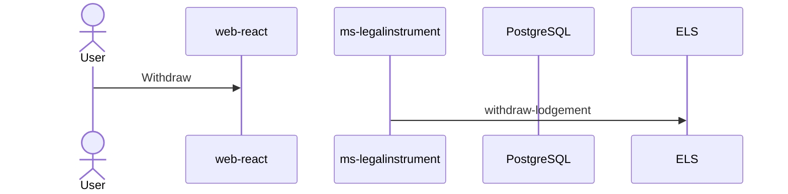

# Low-Level Design — batch-42132

**Epic / Batch:** batch-42132
**Story:** SLADCYBQSK-42132: Post Lodgment Withdrawal
**Status:** Draft

## Summary

### Changes Summary
| # | Layer | Component | Change Type | AC Reference |
|---|-------|-----------|-------------|--------------|
| 1 | Frontend | LodgmentForm | Modified | AC-1, AC-3 |
| 2 | Backend | ms-legalinstrument / WithdrawInstrumentOrchestrator | New | AC-1, AC-2 |
| 3 | Database | Lodgement.InstrumentWithdrawal | New | AC-1 |

### Graph Analysis & Code Reuse Summary
| Layer | Reused | Extended | New | Total | Reuse % |
|-------|--------|----------|-----|-------|---------|
| Controllers | 1 | 1 | 1 | 3 | 33 |
| Services | 0 | 1 | 2 | 3 | 0 |
| Frontend components | 1 | 2 | 0 | 3 | 33 |

### Blast-Radius Summary
| Requirement / AC | Services | Blast radius (Low/Med/High) |
|---|---|---|
| SLADCYBQSK-42132 / AC-1 | ms-legalinstrument | High |

---

## AC-1: Withdraw one or more lodged instruments

### 1.2 Alternate Flows
| # | Flow | Trigger Condition | Expected Behavior | UI Feedback |
|---|------|-------------------|-------------------|-------------|
| 1 | Withdraw single instrument | Withdraw action link | request raised | toast |
| 2 | Withdraw multiple instruments | 2+ checkboxes selected | request raised | toast |
| 3 | Confirm withdrawal | confirm popup | proceeds | popup |

### 1.3 Impact Analysis
| # | Layer | Component/Service | Current Behavior | Impact (Low/Med/High) | Change Required |
|---|-------|-------------------|------------------|-----------------------|-----------------|
| 1 | Backend | ms-legalinstrument / WithdrawInstrumentOrchestrator | none | High | new orchestration endpoint |
| 2 | Frontend | LodgmentForm | read-only list | Medium | add withdraw affordances |

- **Blast radius for this AC:** High — shared lodgement table.

### 1.4 Reusability Assessment
| # | Candidate | Location (file/endpoint) | Satisfies | Reuse Level (0/1/2/4) | Decision | Gap Justification / Evidence |
|---|-----------|--------------------------|-----------|-----------------------|----------|------------------------------|
| 1 | `LodgmentForm` | `web-react/src/pages/LodgmentForm.tsx` | partially | 2 | EXTEND | add action column |
| 2 | `ConfirmDialog` | `web-react/src/components/ConfirmDialog.tsx` | fully | High | REUSE | N/A |
| 3 | `LodgementService.find` | `ms-legalinstrument/service/LodgementService.java` | partially | Low | EXTEND | new guards |
| 4 | `Lodgement.InstrumentWithdrawal` | `Lodgement.InstrumentWithdrawal` | no | None | NEW | new table |

### 1.6 UI Changes

#### Component: `LodgmentForm` (`web-react/src/pages/LodgmentForm.tsx`)
- **Change Type:** Modified · **Reuse:** EXTEND
- **Screen Reference:** `screens/lodgment-form.png`

#### Component: `WithdrawConfirmDialog` (`web-react/src/components/WithdrawConfirmDialog.tsx`)
- **Change Type:** New · **Reuse:** REUSE
- **Screen Reference:** `screens/withdraw-confirm.png`

### 1.7 Microservice Changes

#### Service: `ms-legalinstrument`
- **Endpoint:** `POST /api/ext/v1/lodgement/{lodgementId}/withdraw`

### 1.8 BPM Changes
**No BPM changes required for this AC.**

---

## AC-2: ELS status sync

### 2.3 Impact Analysis
| # | Layer | Component/Service | Current Behavior | Impact (Low/Med/High) | Change Required |
|---|-------|-------------------|------------------|-----------------------|-----------------|
| 1 | Backend | ms-legalinstrument / StatusUpdateHandlerRegistry | handles lodgment updates | Medium | add withdrawal handler |

### 2.4 Reusability Assessment
| # | Candidate | Location (file/endpoint) | Satisfies | Reuse Level (0/1/2/4) | Decision | Gap Justification / Evidence |
|---|-----------|--------------------------|-----------|-----------------------|----------|------------------------------|
| 1 | `StatusUpdateHandlerRegistry` | `ms-legalinstrument/webhook/StatusUpdateHandlerRegistry.java` | partially | 2 | EXTEND | new update type |

### 2.8 BPM Changes
**No BPM changes required for this AC.**

---

## AC-3: Copy a withdrawn instrument

### 3.2 Alternate Flows
| # | Flow | Trigger Condition | Expected Behavior | UI Feedback |
|---|------|-------------------|-------------------|-------------|
| 1 | Copy instrument | Copy action link on Withdrawn row | create page pre-filled | navigation |

### 3.3 Impact Analysis
| # | Layer | Component/Service | Current Behavior | Impact (Low/Med/High) | Change Required |
|---|-------|-------------------|------------------|-----------------------|-----------------|
| 1 | Backend | ms-legalinstrument / CopyInstrumentService | none | High | deep-copy aggregate |

### 3.4 Reusability Assessment
| # | Candidate | Location (file/endpoint) | Satisfies | Reuse Level (0/1/2/4) | Decision | Gap Justification / Evidence |
|---|-----------|--------------------------|-----------|-----------------------|----------|------------------------------|
| 1 | `CreateInstrumentPage` | `web-react/src/pages/CreateInstrumentPage.tsx` | fully | 4 | REUSE | N/A |
| 2 | `InstrumentRepository` | `ms-legalinstrument/repository/InstrumentRepository.java` | partially | 2 | EXTEND | copy lineage |

### 3.6 UI Changes

#### Component: `LodgmentForm` (`web-react/src/pages/LodgmentForm.tsx`)
- **Change Type:** Modified
- **Screen Reference:** `screens/lodgment-form.png`

### 3.8 BPM Changes
**No BPM changes required for this AC.**
